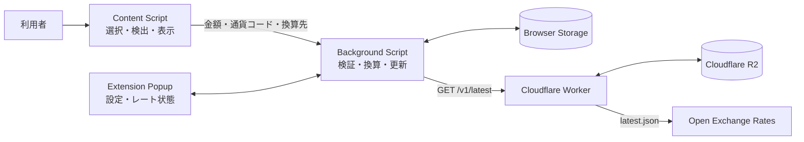

# アーキテクチャ

Currency Lensの通信設計は単純です。選択テキストの解析と換算をブラウザ内で行い、為替レートの取得だけをCloudflare Workerへ集約します。この文書では、実装から確認できるデータフロー、データの正本、信頼境界、失敗時の挙動を扱い、デプロイ先の初期設定は[デプロイとストア公開](deployment.md)へ分けます。

## 全体構成

R2は公開しません。Content ScriptとPopupからの外部通信、レートキャッシュ、換算処理はBackground Script、提供元APIとR2の境界はWorkerが所有します。

## コンポーネント

| コンポーネント       | 責務                                                                                            |
| -------------------- | ----------------------------------------------------------------------------------------------- |
| Content Script       | 選択範囲の監視、最大3件の金額検出、Background Scriptへの依頼、Shadow DOM内のUI表示              |
| Background Script    | メッセージの検証、最大5件の換算先との一括換算、レート更新、設定とキャッシュへのアクセス         |
| Extension Popup      | お気に入り通貨などの設定、レートの提供元時刻と古さの表示                                        |
| Currency Lens Worker | `GET /v1/latest`と旧`GET /latest`、R2データの検証、空のR2の初期化、Cron Triggerによるレート更新 |
| `packages/currency`  | 拡張機能が検出・設定・表示できる通貨コード、記号、表示桁数のメタデータ                          |
| `packages/oxr`       | Open Exchange RatesのHTTPクライアント、timeoutとエラー分類、レスポンス検証                      |

## データの正本

| データ                           | 正本                                    | 補足                                            |
| -------------------------------- | --------------------------------------- | ----------------------------------------------- |
| 為替レートの値と提供時刻         | Open Exchange Ratesの検証済みレスポンス | Workerや拡張機能の取得時刻で上書きしない        |
| 配信中の最新スナップショット     | R2の`latest.json`                       | Workerが読み出すたびに検証する                  |
| 過去のスナップショット           | R2の提供元時刻別オブジェクト            | `latest.json`より先に保存する                   |
| 拡張機能が最後に利用できたレート | `browser.storage.local`                 | 更新失敗や古さだけでは削除しない                |
| お気に入り通貨などのユーザー設定 | `browser.storage.sync`                  | 読み書き時に検証し、旧形式は移行する            |
| 検出・表示に対応する通貨         | `packages/currency`                     | OXR側の未知コードをUIの対応通貨へ自動追加しない |
| プロセス間メッセージの形         | `lib/messages.ts`のZodスキーマ          | 送信前と受信後の両方で検証する                  |

鮮度の基準は`sourceTimestamp`です。これはOpen Exchange Ratesの提供元時刻であり、拡張機能がWorkerから取得できた時刻は`fetchedAt`へ分けて記録します。

## データフロー

### 選択から換算まで

1. Content Scriptが通常のWebページで選択テキストを受け取ります。
2. 通貨コード、通貨記号、数値の区切りをページとブラウザのロケールも使って解析し、先頭から最大3件を検出します。
3. Content Scriptは選択テキスト全体を送らず、検出した金額と通貨コード、お気に入りの換算先通貨だけをBackground Scriptへ渡します。
4. Background Scriptがメッセージを検証し、最後に成功したキャッシュを使って最大3金額×5通貨を換算します。
5. 結果ごとの成否とレート時刻、古さ、警告をContent Scriptへ返し、Shadow DOM内へ表示します。

選択文字列はブラウザから出ません。換算結果と元の表記を対応付けて表示する場合も、文字列をBackground ScriptやWorkerへ渡す必要はありません。

### 拡張機能のレート更新

1. インストール、ブラウザ起動、Background Script初期化の各時点で、1時間ごとのalarmが存在することを確認します。
2. キャッシュがない、または提供元時刻から24時間を超えている場合に`GET /v1/latest`を呼びます。インストール時とブラウザ起動時は、キャッシュの年齢にかかわらず更新を試みます。
3. WorkerレスポンスをZodで検証し、すべて通った場合だけ`browser.storage.local`のキャッシュを置き換えます。
4. 以後はalarmが1時間ごとに更新を試みます。

更新成功時だけキャッシュを置き換えます。失敗時は最後に成功した値を維持し、24時間を超えても換算を続けながら、利用者へ古いレートであることを示します。

WXTは、開発と配布の両方で検証済みの`API_ENDPOINT`をベースURLとし、そのホスト権限をmanifestへ生成します。Background ScriptはベースURLへ`/v1/latest`を付けてレートを取得します。ローカル開発では`.env`、配布用ビルドではGitHub ActionsのRepository variableから同じ変数名へ値を渡します。

### Workerの更新と配信

1. 1時間ごとのCron Triggerが`packages/oxr`を通してOpen Exchange Ratesの`latest.json`を取得します。
2. HTTP成功、JSON、通貨コード、正の有限レート、base、提供元時刻を検証します。OXRが追加する未知の通貨コードは、形式と値が妥当なら受け入れます。
3. R2へ提供元時刻別のアーカイブを書き、その後で`latest.json`を更新します。
4. `GET /v1/latest`と旧`GET /latest`はR2の`latest.json`を改めて検証し、拡張機能に必要な`base`、`rates`、`timestamp`だけを返します。

書き込み順は固定です。R2が空でWorker secretが存在するときは、最初のレートAPIリクエストが手順1から3を実行して初期データを作り、同じWorkerインスタンスで重なった初回リクエストは1回の取得へまとめます。

## 信頼境界

| 境界                                      | 検証と制約                                                  |
| ----------------------------------------- | ----------------------------------------------------------- |
| 選択テキスト                              | Content Script内で長さと検出件数を制限し、外部へ送信しない  |
| Content Script・Popup → Background Script | 判別可能なZodスキーマでメッセージと件数を検証する           |
| Browser Storage → 拡張機能                | 設定とキャッシュを読み出すたびに検証する                    |
| Worker → 拡張機能                         | HTTP statusとJSONを確認し、レスポンス全体をZodで検証する    |
| R2 → Worker                               | `latest.json`を`unknown`として読み、OXRスキーマで検証する   |
| Open Exchange Rates → Worker              | timeout、HTTP非成功、不正JSON、契約不一致を分けて失敗させる |

Open Exchange RatesのApp IDはWorker secretです。拡張機能、R2オブジェクト、レスポンス、ログには含めません。WorkerのCORSはChrome・Firefox拡張機能のoriginとGETだけを許可します。CORSは認証ではありません。

## 失敗時の挙動

| 状況                                       | 挙動                                                       |
| ------------------------------------------ | ---------------------------------------------------------- |
| 選択範囲に対応通貨がない                   | アイコンや換算結果を表示しない                             |
| Background Scriptに有効なキャッシュがない  | 換算不可を返し、レートの準備ができていないことを表示する   |
| 特定通貨のレートだけがない                 | その組み合わせだけを利用不可とし、他の換算結果は返す       |
| 拡張機能のレート更新に失敗                 | 最後に成功したキャッシュを残し、24時間超なら古さを表示する |
| OXRのtimeout、HTTP非成功、不正JSON         | 新しいR2データを書かず、既存の`latest.json`を維持する      |
| R2が空でsecretがない、または初回取得に失敗 | Workerは`503`を返す                                        |
| R2の`latest.json`が不正                    | Workerは`503`を返し、不正データを自動で上書きしない        |
| R2アーカイブへの書き込みに失敗             | `latest.json`を更新しない                                  |
| ユーザー設定が不正                         | 旧形式の移行を試し、移行できなければ既定値を使う           |

## 設計判断

### 選択した箇所だけを扱う

ページ全体を走査して価格を書き換える方式は採らず、利用者が選択した範囲だけを解析することで、元の表示を維持しながら誤検出の影響を限定します。

### 選択テキストを送信しない

通貨検出はContent Script内で完結します。Background Scriptが必要とするのは数値と通貨コードだけであり、Workerが必要とするのは為替レートだけです。この分離により、閲覧内容をサーバーへ渡さずに換算できます。

### 最後に成功したレートを優先する

一時的な通信障害で換算を全面停止するより、提供時刻と警告を示して最後のレートを使える方を選びます。24時間は利用禁止の境界ではなく、利用者へ古さを知らせる境界です。

### R2をWorkerの後ろに置く

拡張機能からR2を直接読ませず、Workerで保存データを検証してCORS、エラー応答、初回取得を一か所へ集めることで、R2の構成や認証情報を拡張機能から隠します。

### 上流の拡張とUIの対応範囲を分ける

WorkerはOXRが追加した未知の通貨コードを形式と値で検証して保持しますが、拡張機能の検出と設定は`packages/currency`に収録した通貨だけを扱うため、上流APIの拡張で配信を止めず、UIへ出す通貨はメタデータを追加してから有効にできます。

### 配布済み拡張機能のAPI契約を維持する

拡張機能はストア審査と利用者の更新を経るため、Workerと同時には切り替わりません。`/v1/latest`と、移行前の拡張機能が使う`/latest`は、`base`、`rates`、`timestamp`だけを持つ同じstrict schemaとして維持します。トップレベル項目の追加を含む形の変更は既存クライアントにとって破壊的なので、`/v2/latest`のような新しいrouteへ分けます。

GitHub Releaseからストアへ提出する前に、release tagと同じcommitのCloudflareデプロイ成功を待ち、公開中の現行routeと旧routeを、そのcommitから配布するクライアントのZod schemaで検証します。旧routeを廃止する時期は自動で決めず、対応する配布済み拡張機能が利用されなくなったことを確認したうえで人間が判断します。

### 件数を3金額×5通貨に制限する

長い選択範囲から無制限に結果を作ると、誤検出と表示量が増えます。上限は15件です。入力とメッセージの両方で件数を検証します。

### UIをShadow DOMへ隔離する

Content Scriptは第三者のWebページ上で動くため、ページと拡張機能のCSSを同じDOMに置くと表示が不安定になります。Shadow DOMを境界にして、ページ本体を変更せずにアイコンと換算結果を表示します。
