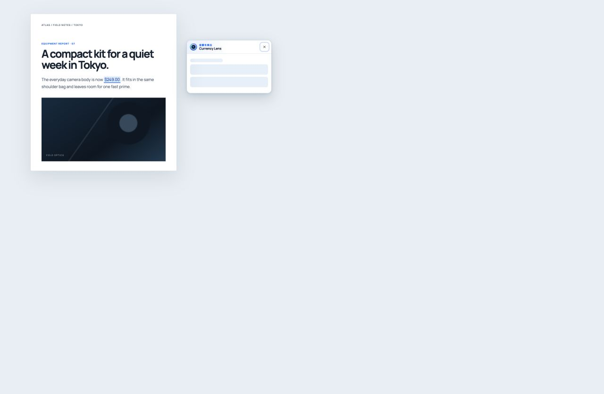
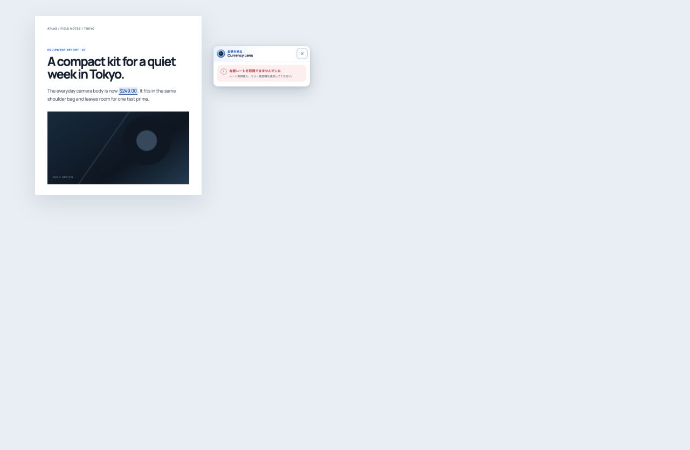
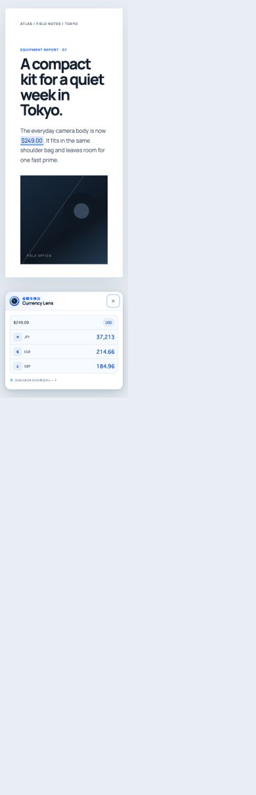

# 画面品質の確認記録

この文書は、Currency Lens の主要画面を実ブラウザで確認した結果と、再現に使うプレビュー入口を記録します。
画面の正本は実装であり、この文書と画像は変更時の比較資料です。

## 換算カード

2026年8月28日に Chromium ベースのブラウザで、日本語・ライトテーマの換算カードを確認しました。
プレビューは環境ファイルを読まない `design-preview/vite.config.ts` を使用します。

```sh
pnpm exec vp dev --config apps/browser-extension/design-preview/vite.config.ts --host 127.0.0.1 --port 4173 --strictPort
```

`conversion.html` の `state` には `success`、`loading`、`empty`、`error` を指定できます。
値が不正な場合は `success` を表示します。

| 確認対象     | プレビュー                                    | 実ブラウザで確認した内容                                                                                                                                                                                         |
| ------------ | --------------------------------------------- | ---------------------------------------------------------------------------------------------------------------------------------------------------------------------------------------------------------------- |
| 成功         | `conversion.html?state=success`               | 選択元は `$249.00`／USD の1件だけで、換算先は設定順の JPY、EUR、GBP の3件です。レート時点も日本語で表示されます。                                                                                                |
| 読み込み中   | `conversion.html?state=loading`               | スケルトンだけを表示し、`role="status"` と「通貨を換算中」のラベルを持ちます。                                                                                                                                   |
| 空           | `conversion.html?state=empty`                 | 「対応している金額が見つかりませんでした。」を表示します。                                                                                                                                                       |
| エラー       | `conversion.html?state=error`                 | 再試行を促す日本語メッセージを `role="alert"` で表示します。                                                                                                                                                     |
| キーボード   | `conversion.html?state=success`               | 開いた直後に閉じるボタンへフォーカスし、`:focus-visible` が有効です。フォーカスリングは3pxの実線として表示されます。                                                                                             |
| 動きを抑える | `conversion.html?state=loading&motion=reduce` | QA専用の動作抑制モードで、アニメーションとトランジションは0.01ms、反復は1回になります。本番の `prefers-reduced-motion: reduce` と同じCSS値を再現した確認であり、ブラウザのメディアクエリ自体の発火は未検証です。 |
| 狭い幅       | 幅390px、`conversion.html?state=success`      | DOM実測のカード幅は360pxで、横方向のはみ出しはありません。画像は撮影基盤側で縮小表示されるため、寸法の根拠にはDOM実測値を使用しています。                                                                        |

すべての状態を移動した後のブラウザコンソールエラーは0件でした。

### 成功


### 読み込み中



### 空


### エラー



### キーボードフォーカス


### 動きを抑える設定


### 狭い幅



## Popup と換算設定

Popup と換算設定の比較画像は `docs/assets/design-qa/` に保存しています。

- `popup-conversion-settings.png`
- `options-conversion-settings.png`
- `options-conversion-settings-narrow.png`
